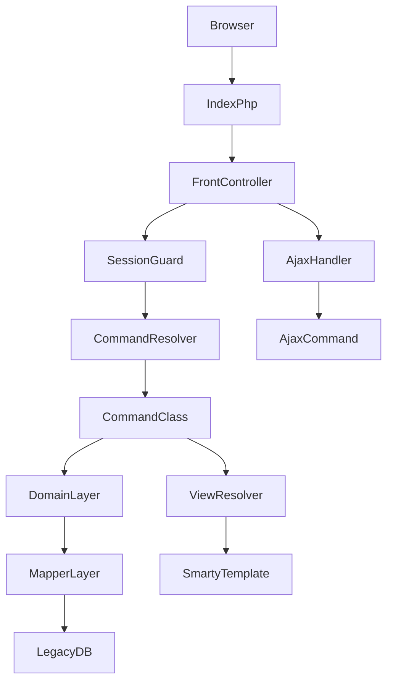
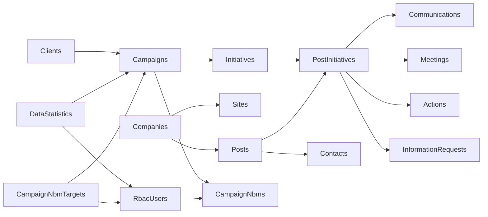

# Legacy PHP System Documentation + Laravel Migration Plan

## 1) Project Overview

### What the application does
- This is a CRM/PRM-style internal web application for outreach and campaign execution.
- It helps NBM/sales teams manage companies, sites, posts/contacts, communications, meetings, actions, and campaign initiatives.
- It includes KPI tracking, monthly planning, reporting, list filtering/export, and admin tooling.

### Main purpose and workflow
- A user logs in, lands on `Home`, then works through tabbed modules rendered in iframes.
- Most requests follow `index.php?cmd=<CommandName>` and are dispatched by a front controller.
- Commands call domain and mapper classes for DB work, then render Smarty templates.

### Runtime flow (request lifecycle)
1. `index.php` starts session, loads env/config, registers autoloaders, then calls `app_controller_Controller::run()`.
2. `Controller` validates session (except Login/Logout), loads session-persisted domain objects, resolves command by `cmd`.
3. `AppController` maps command/view using `data/app_options.xml`.
4. Command executes (`app/command/*`) and returns a status (`CMD_OK`, etc.).
5. View is resolved (`app/view/*`) and Smarty template (`app/view/templates/*.tpl`) is rendered.

### Architecture (current state)

### Key technical characteristics
- Legacy stack: custom front-controller/command framework + Smarty + MDB2/EasySql.
- Hybrid modernization present: `Illuminate\Database\Capsule` is initialized in `ApplicationHelper`, while many queries still use legacy mapper SQL.
- Config/routing is XML-driven via `data/app_options.xml`.

---

## 2) Authentication Flow

### Login process
- Login form posts to `index.php?cmd=Login` from `app/view/templates/Login.tpl`.
- `app/command/Login.php` reads `username/password/submitted` and calls `Auth_Session::login(...)`.
- Credential validation in `include/Auth/Session.php`:
  - User lookup from `tbl_rbac_users` (`handle`, `is_active=1`).
  - Password check is `md5(input_password) == stored_hash`.
  - Optional IP whitelist check via `app_model_Whitelist` unless `permission_bypass_whitelist` is set.
- On success:
  - Session payload `$_SESSION['auth_session']['user']` is populated.
  - Login is logged via `app_model_LoginLog`.
  - Redirect goes to `index.php?cmd=Home`.

### User roles/permissions
- Effective authorization is permission-flag driven at command level (`$this->session_user->hasPermission('permission_x')`).
- `app_command_Command::execute()` calls `hasPermission()`; commands can override it.
- Menu/tab visibility in templates is also permission-gated.
- Role mapping classes exist (`RbacRoleMapper`, `RbacPermissionMapper`), but runtime checks primarily use user permission flags.

### Session handling
- Session starts in `index.php` (`session_start()`).
- Global guard: `Controller::validateSession()` enforces authentication for all commands except Login/Logout.
- `Auth_Session::authenticate()` re-validates active user by checking session `handle + md5_password` against DB.
- Logout flow:
  - `app/command/Logout.php` calls `Auth_Session::logout()`.
  - Session is destroyed (`session_unset(); session_destroy();`).
  - User is redirected to `Login`.

### Security notes (important for migration)
- Legacy password hashing is MD5 (must be replaced with Laravel `Hash`/bcrypt or Argon2).
- Multiple SQL strings are concatenated directly in legacy mappers/commands (SQL injection risk areas).
- `app_options.xml` currently contains environment DB credentials in plaintext (secrets management risk).

---

## 3) Main Modules / Tabs (After Login)

Top-level tabs come from `app/view/templates/Home.tpl`:
- Dashboard
- Monthly Planner
- Actions & Calendar
- Communication
- Search Workspace
- Search
- Filter Workspace
- Filter Results
- Filter List
- Mailers
- Reporting
- Administration

### 3.1 Dashboard
- **Primary commands:** `DashboardFrame`, `Dashboard`, `DashboardCallBacks`, `DashboardInformationRequests`, `DashboardMeetings`, `DashboardMessages`, `DashboardNbms`, `DashboardTeams`, `DashboardGraph1`.
- **Functionality:** daily workload and KPI cockpit (callbacks, info requests, meetings, messages, team stats, campaign progress).
- **Data shown:** today due items, client targets vs actuals, recommended stats, calendar month data, team metrics.
- **User actions:** review due items, switch NBM (with permission), inspect dashboard sub-sections.
- **Backend logic:** `app/command/Dashboard.php`; uses domain calls like `PostInitiative::findCallBacksByUserId`, `InformationRequest::findByUserId`, `Meeting::findByUserId`, `Client::findTargetsByClientIdAndYearmonth`, `ReportReader::getRequiredStats`.
- **Main tables/views involved:** `tbl_post_initiatives`, `tbl_information_requests`, `tbl_meetings`, `tbl_actions`, `tbl_events`, `tbl_campaigns`, `tbl_clients`, `tbl_data_statistics`, `tbl_campaign_nbm_targets`.

### 3.2 Monthly Planner
- **Primary command:** `NbmMonthlyPlanner`.
- **Functionality:** per-user monthly target vs actual planning, KPI variances, working-day math, campaign-level rows.
- **Data shown:** call/effective/meeting targets, actuals, access/conversion rates, working days booked/worked.
- **User actions:** select month/user, review campaign planning and summary metrics.
- **Backend logic:** `app/command/NbmMonthlyPlanner.php`; uses `CampaignNbmTarget`, `StatisticsReader`, `Event`, `Utils::getWorkingDays`.
- **Main tables involved:** `tbl_campaign_nbm_targets`, `tbl_data_statistics`, `tbl_events`, `tbl_campaigns`, `tbl_clients`, `tbl_campaign_nbms`, `tbl_rbac_users`.

### 3.3 Actions & Calendar
- **Primary commands:** `ActionsFrame`, `Calendar`, `CalendarDay`, `DashboardActions`, `DashboardEvents`.
- **Functionality:** personal/client/NBM/global calendar and action/event lists.
- **Data shown:** scheduled activities, actions due, event calendars.
- **User actions:** switch calendar scope, navigate day/month context, manage action/event flows.
- **Backend logic:** calendar/action/event command/domain classes under `app/command` + related mappers.
- **Main tables involved:** `tbl_actions`, `tbl_events`, `tbl_bank_holidays`, `tbl_meetings`, `tbl_post_initiatives`.

### 3.4 Communication
- **Primary commands:** `Communication`, `CommunicationCreate`, `CommunicationEdit`, `CommunicationSaved`, `CommunicationEmailCreate`, `CommunicationAttachments`.
- **Functionality:** create/update communication logs and associated notes/attachments.
- **Data shown:** communication history and status-linked initiative context.
- **User actions:** add/edit communication notes, create communication emails, handle attachments.
- **Backend logic:** communication commands + domain entities for communications/post initiatives.
- **Main tables involved:** `tbl_communications`, `tbl_post_initiatives`, `tbl_post_initiative_notes`, `tbl_lkp_communication_status`.

### 3.5 Search Workspace
- **Primary command:** `WorkspaceSearch` (plus workspace detail commands).
- **Functionality:** intermediate workspace for selected company/post/initiative context.
- **Data shown:** selected records and context panes (company/post/client/prospect/tasks/tags).
- **User actions:** drill into records and related detail screens.
- **Backend logic:** workspace commands (`WorkspaceCompany`, `WorkspacePost`, `WorkspacePostInitiative`, etc.).
- **Main tables/views involved:** `tbl_companies`, `tbl_sites`, `tbl_posts`, `tbl_post_initiatives`, `tbl_campaigns`, `tbl_clients`, `vw_contacts`, `vw_posts_contacts`.

### 3.6 Search
- **Primary commands:** `Search`, `SearchResults`.
- **Functionality:** keyword and structured search for companies, contacts, postcodes, telephones, project refs, brands, initiatives.
- **Data shown:** result list plus derived site/post/contact enrichment.
- **User actions:** run search by type and open selected records into workspace.
- **Backend logic:** `app/command/SearchResults.php` and domain finder methods (`Company`, `Contact`, `Tag`) with post/site enrichment.
- **Main tables/views involved:** `vw_companies`, `vw_companies_sites`, `vw_contacts`, `vw_posts`, `vw_posts_contacts`, `tbl_tags`, `tbl_company_tags`, `tbl_post_tags`, `tbl_post_initiative_tags`.

### 3.7 Filter Workspace
- **Primary commands:** `WorkspaceFilter`, `FilterBuilder`, `FilterBuilderCreate`, `FilterBuilderPrint`, `FilterExport`, `AjaxFilterResults`.
- **Functionality:** build and run saved filters to generate result sets and exports.
- **Data shown:** criteria lines, generated result sets, counts, export previews.
- **User actions:** build/edit criteria, run filter, print/export.
- **Backend logic:** `app/domain/FilterBuilder.php`, `app/mapper/FilterBuilderMapper.php`.
- **Main tables involved:** `tbl_filters`, `tbl_filter_lines`, `tbl_filter_results`, plus many joined business tables for output formats.

### 3.8 Filter Results
- **Primary command:** `FilterResults`.
- **Functionality:** display materialized outputs for a selected filter.
- **Data shown:** company/site/post/initiative/meeting rows depending on format.
- **User actions:** review, navigate, trigger exports.
- **Backend logic:** filter result retrieval from `FilterBuilderMapper`.
- **Main tables involved:** `tbl_filter_results` plus format-dependent joins (`tbl_companies`, `tbl_posts`, `tbl_post_initiatives`, etc.).

### 3.9 Filter List
- **Primary command:** `FilterList`.
- **Functionality:** saved filter management/listing.
- **Data shown:** existing filters and metadata.
- **User actions:** select, edit, run, print/export filters.
- **Backend logic:** filter metadata mapping.
- **Main tables involved:** `tbl_filters`, `tbl_filter_lines`.

### 3.10 Mailers
- **Primary commands:** `MailerList`, `MailerCreate`, `MailerEdit`, `MailerItemCreate`, `MailerItemList`, `MailerItemListBatch`, `MailerExport`, `MailerStatistics`, `MailerStatisticsGraph1/2/3`.
- **Functionality:** mailing list creation/execution and statistics.
- **Data shown:** mailer entries, batch items, response metrics, graphs.
- **User actions:** create/edit mailers, export lists, review stats.
- **Backend logic:** mailer command/mapper classes.
- **Main tables involved:** `tbl_mailer_items`, `tbl_mailer_item_responses` (and mailer-related entities in module-specific code).

### 3.11 Reporting
- **Primary commands:** `Reporting`, `ReportParams`, `Report1`, `Report2`, `Report3`, `Report4`, `Report5`, `Report7`, `Report10`, `Report11`, `Report12`, `Report13`, `Report14`, campaign summary commands.
- **Functionality:** operational and KPI reports over configurable date ranges/users/clients/teams.
- **Data shown:** allocation, activity stats, source of meetings, target vs actual, notes activity, global analyses, bonus reports.
- **User actions:** choose report + parameters, generate/export outputs.
- **Backend logic:** parameter collection in `ReportParams`; heavy SQL in `ReportReaderMapper`.
- **Main tables involved:** `tbl_data_statistics`, `tbl_campaign_nbm_targets`, `tbl_communications`, `tbl_meetings`, `tbl_meetings_shadow`, `tbl_campaigns`, `tbl_clients`, `tbl_rbac_users`, tags/notes tables.

### 3.12 Administration
- **Primary commands (menu-driven):** `CampaignView`, `ClientList`, `CharacteristicList`, `AdminRegions`, `AdminRegionPostcodes`, `AdminReports`, `User`, `Dedupe`, `Categories`, `Whitelist`, `Postcode`.
- **Functionality:** master/admin data management and governance.
- **Data shown:** campaign/client definitions, characteristics, regions/postcodes, users, whitelist, dedupe/admin reports.
- **User actions:** create/edit administrative records (permission-gated).
- **Backend logic:** multiple admin command classes with permission checks in templates and commands.
- **Main tables involved:** `tbl_campaigns`, `tbl_clients`, `tbl_rbac_users`, `tbl_lkp_regions`, `tbl_lkp_region_postcodes`, `tbl_lkp_postcodes`, `tbl_object_characteristics*`, whitelist-related tables/models.

---

## 4) Database Analysis

## 4.1 Tables and views referenced in code

### Core entity tables
- `tbl_clients`
- `tbl_campaigns`
- `tbl_campaign_nbms`
- `tbl_campaign_targets`
- `tbl_campaign_nbm_targets`
- `tbl_campaign_disciplines`
- `tbl_initiatives`
- `tbl_companies`
- `tbl_parent_company`
- `tbl_sites`
- `tbl_posts`
- `tbl_contacts`
- `tbl_post_initiatives`
- `tbl_post_initiative_notes`
- `tbl_communications`
- `tbl_meetings`
- `tbl_meetings_shadow`
- `tbl_actions`
- `tbl_events`
- `tbl_information_requests`

### RBAC/auth/session tables
- `tbl_rbac_users`
- `tbl_rbac_sessions`

### Stats/reporting/team tables
- `tbl_data_statistics`
- `tbl_data_statistics_daily`
- `tbl_data_statistics_run`
- `tbl_team_nbms`
- `tbl_teams`

### Lookup/config tables
- `tbl_lkp_reports`
- `tbl_lkp_data_sources`
- `tbl_lkp_communication_status`
- `tbl_lkp_regions`
- `tbl_lkp_region_postcodes`
- `tbl_lkp_postcodes`
- `tbl_lkp_counties`
- `tbl_lkp_countries`
- `tbl_lkp_lead_source`
- `tbl_bank_holidays`

### Tags/categories tables
- `tbl_tags`
- `tbl_tag_categories`
- `tbl_company_tags`
- `tbl_post_tags`
- `tbl_post_initiative_tags`

### Characteristics/tiered-characteristics tables
- `tbl_object_characteristics`
- `tbl_object_characteristics_text`
- `tbl_object_characteristics_boolean`
- `tbl_object_characteristics_date`
- `tbl_object_characteristic_elements_text`
- `tbl_object_characteristic_elements_boolean`
- `tbl_object_characteristic_elements_date`
- `tbl_object_tiered_characteristics`
- `tbl_company_tiered_characteristics`
- `tbl_tiered_characteristics`
- `tbl_post_discipline_review_dates`
- `tbl_post_decision_makers`
- `tbl_post_agency_users`
- `tbl_post_incumbent_agencies`

### Filter/mailer/admin/support tables
- `tbl_filters`
- `tbl_filter_lines`
- `tbl_filter_results`
- `tbl_mailer_items`
- `tbl_mailer_item_responses`
- `tbl_company_notes`

### Legacy include-layer tables (capitalized variants)
- `tbl_Users`
- `tbl_Clients`
- `tbl_Databases`
- `tbl_Sessions`

### Views (`vw_*`)
- `vw_client_initiatives`
- `vw_companies`
- `vw_companies_sites`
- `vw_contacts`
- `vw_posts`
- `vw_posts_contacts`
- `vw_calendar_meetings` (inferred usage path)
- `vw_events` (inferred usage path)

### Temporary/scratch tables used in SQL workflows
- `t_max_company`
- `tmp_NbmsWithCallsInPeriod`
- `t_include_count`
- `t_include_post_count`
- `t_filter_stats`
- `t_communications`
- `t_meetings_set`
- `t_information_requests`
- `t_callbacks`
- `t_priority_callbacks`

## 4.2 Relationships (inferred from joins and method usage)

### Confidence levels
- **High confidence:** relationships repeatedly used in joins (`client->campaign->initiative->post_initiative`, user/campaign target/stat links).
- **Medium confidence:** entities mainly visible through views (`vw_*`) without underlying DDL.
- **Lower confidence:** legacy/rarely used tables present in include-layer code paths.

---

## 5) Key Functionalities

### 5.1 Reports generation
- Report selection and defaults are handled in `app/command/ReportParams.php` (IDs map to report names).
- Report execution commands (`Report1...`) delegate heavy querying to `app/mapper/ReportReaderMapper.php`.
- Common report query patterns:
  - Aggregate `tbl_data_statistics` + `tbl_campaign_nbm_targets` for target vs actual.
  - Join communications/meetings/actions by `post_initiative_id`.
  - Join campaign hierarchy (`clients/campaigns/initiatives`) and user/team dimensions.
- Output appears to be rendered in report-specific views/exports and some graph commands.

### 5.2 Search functionality
- `SearchResults` accepts `search_type` + params and routes to specific domain finder methods.
- Supports name/phone/postcode and tag-based searches (project ref, brand, initiative-constrained).
- Pagination is explicitly implemented for some searches (`page_size = 500` with total count for project-ref searches).
- Result enrichment step fetches extra site/post info per row.

### 5.3 Scheduling/planning logic (monthly planner)
- `NbmMonthlyPlanner` computes:
  - Month boundaries and working-day totals.
  - Booked days vs workable days.
  - Campaign-level targets vs actuals.
  - KPI variances (`calls/effectives/meetings/access/conversion`) and derived targets for remainder of month.
- Data comes from:
  - target tables (`tbl_campaign_nbm_targets`)
  - actual/stat tables (`tbl_data_statistics`)
  - bookings/events (`tbl_events`)

---

## 6) Code Structure Analysis

### Important PHP files and their roles
- `index.php`: bootstrap, environment loading, error config, autoloading, front-controller entry.
- `app/controller/Controller.php`: central request handling, session validation, command dispatch, AJAX branch.
- `app/controller/AppController.php`: resolves command class, view mapping, forward chain.
- `app/controller/ApplicationHelper.php`: config loading (`app_options.xml`), DB setup (MDB2 + Illuminate capsule), controller map build.
- `app/command/*`: unit-of-work request handlers (business actions per `cmd`).
- `app/domain/*`: domain-level APIs and objects.
- `app/mapper/*`: data access and large SQL logic.
- `app/view/*` + `app/view/templates/*`: view adapters and Smarty templates.
- `include/Auth/Session.php`: authentication/session lifecycle.
- `app/ajax/*`: AJAX request/response infrastructure.

### Reusable core logic patterns
- Command pattern with status codes (`CMD_OK`, `CMD_ERROR`, etc.) and command-to-view forwarding.
- Registry/config map pattern (`ApplicationRegistry`, `ControllerMap`).
- Mapper-based data access with explicit SQL and collection wrappers.
- Shared utility helpers (`Utils`, string/date helpers) used in planning/reporting.

### Migration-significant technical debt signals
- Tight coupling between commands, templates, and SQL-heavy mappers.
- Large monolithic SQL methods (especially reporting/filter builder).
- Legacy template + iframe tab UX with JS-heavy navigation.
- Mixed DB access strategy (legacy + Eloquent) requiring staged unification.

---

## 7) Laravel Migration Plan

## 7.1 Target Laravel structure mapping

### Routes (`cmd` -> Laravel routes)
- Current: `index.php?cmd=Something`.
- Target:
  - `routes/web.php`: page routes grouped by module (`/dashboard`, `/planner`, `/reports/...`).
  - `routes/api.php`: AJAX endpoints replacing `Ajax*` commands.
- Transitional strategy:
  - Add a compatibility route/controller that accepts `cmd` and maps to new handlers during migration.

### Logic (Commands -> Controllers/Services)
- Current `app/command/*` maps to:
  - **Controllers** for request orchestration and validation.
  - **Services** for business workflows (planner calculations, report orchestration, filter execution).
  - **Repositories/Query objects** for heavy SQL segments.
- Keep report/filter/planner calculations in dedicated service classes for testability.

### Views (Smarty -> Blade)
- Convert `app/view/templates/*.tpl` to Blade:
  - common layout (`layouts/app.blade.php`)
  - module views (dashboard/planner/reports/admin/search)
  - reusable Blade components for tab headers, result tables, parameter forms.
- Replace iframe-tab navigation with normal route navigation or SPA-like sections.

### Database (Legacy schema -> Migrations/Models)
- Extract current schema from live DB and generate initial Laravel migrations.
- Build Eloquent models for stable core entities first:
  - User, Client, Campaign, Initiative, Company, Site, Post, PostInitiative, Communication, Meeting, Event, Action.
- Keep complex reporting/filter SQL in query classes initially; migrate incrementally to query builder where safe.

## 7.2 Module-wise phased migration

### Phase 0: Foundation
- Create Laravel app shell inside repo or sibling project.
- Configure DB connections and env secrets correctly (`.env`, no credentials in XML).
- Implement auth guard compatible with existing user table (temporary MD5 compatibility strategy during cutover).

### Phase 1: Auth + Shell Navigation
- Rebuild Login/Logout/session middleware.
- Build main app layout and top navigation skeleton.
- Add permission middleware and policy mapping for existing `permission_*` flags.

### Phase 2: Dashboard + Monthly Planner
- Migrate dashboard read paths and planner computations first (high user value).
- Wrap existing SQL-heavy logic in service/repository classes and add regression tests.

### Phase 3: Search + Workspace + Communication
- Migrate search forms/results and workspace drilldowns.
- Migrate communication CRUD and note/attachment flows.

### Phase 4: Filter Builder + Exports
- Rebuild filter metadata UI and execution pipeline.
- Preserve export behavior, but move large exports to queued jobs/streaming responses.

### Phase 5: Reporting
- Migrate reports report-by-report (1,2,3,4,5,7,10,11,12,13,14).
- Add golden-data comparison tests against legacy outputs for each report.

### Phase 6: Administration + Remaining Edge Modules
- Migrate admin entities (regions/postcodes/characteristics/users/whitelist/dedupe/categories).
- Retire XML routing and legacy command layer after parity verification.

## 7.3 Challenges and risks
- **Auth risk:** MD5 password migration without locking out users.
- **Query complexity risk:** report/filter SQL parity and performance regressions.
- **Schema ambiguity risk:** view-based data and missing FK constraints in legacy DB.
- **Behavior parity risk:** permission-gated UI logic currently split across templates and commands.
- **Operational risk:** credential handling and env selection inconsistencies (e.g., `ALCHEMIS_ENV` semantics).

## 7.4 Risk mitigations
- Dual-run strategy: keep legacy in read-only parallel for report comparison during rollout.
- Snapshot-based regression tests for critical reports and planner totals.
- Feature-flag module cutovers.
- Introduce audit logging and metrics in Laravel for parity monitoring.
- Secrets rotation and centralized configuration before production cutover.

---

## 8) Assumptions / Inferred Details

- This document is based on code inspection and SQL references in source, not direct DB schema DDL.
- Table/view relationships marked as inferred are based on repeated join paths and naming conventions.
- Some commands in `app_options.xml` may be legacy, deprecated, or permission-hidden in current production usage.
- Report command coverage reflects configured commands and mapper methods found in code; some report IDs may be disabled by permissions/client context.

---

## 9) Recommended Immediate Next Steps

1. Export real DB schema (tables, FKs, views, indexes) and attach to this document to upgrade confidence to full.
2. Build a `cmd -> target Laravel route/controller` mapping spreadsheet as sprint backlog.
3. Implement Laravel auth compatibility layer first (temporary MD5 check + rehash on login).
4. Migrate Dashboard + Planner first to establish architecture and testing patterns.
5. Define report parity acceptance criteria before migrating reporting module.
