# Alchemis — Performance & Multi-User Load Report

**Audience:** Tech Lead, Server Team, Management  
**Date:** May 7, 2026  
**Prepared from:** code review of legacy Alchemis (PHP + MySQL, AWS RDS)

---

## 1. Executive Summary (One Page)

Alchemis becomes slow or appears frozen because **heavy data work runs live during user clicks**, on a **single shared MySQL database**, with **no background queue and no caching layer**. The architecture was designed for a small number of concurrent users with smaller data volumes.

As users and data have grown:
- Heavy actions (filter regenerate, big reports, exports) **monopolize PHP workers and MySQL resources**.
- Other users — even those on light screens — feel the slowdown.
- AJAX calls time out or return broken JSON → frontend shows **JS popups / “Failed to parse” / “Please wait” warnings**.

These symptoms are **side effects of the architecture**, not random bugs.

> **The fix is not a rewrite.** It is moving heavy work off the user’s click, adding caching, indexing the database, and tuning the server. Hardware upgrades alone will **not** solve it.

---

## 2. How the Application Was Built

| Indicator in code | Meaning |
|---|---|
| `set_time_limit(300)` in filter & AJAX commands | A single click can run for **up to 5 minutes** — designed for one user at a time |
| `@ini_set('memory_limit', '512M')` raised inside requests | Heavy in-memory work tolerated |
| **No queue / worker system** in codebase | All heavy work runs **synchronously** in the web request |
| **No cache layer** (no APCu/Redis/Memcached) | Same queries are repeated every page load |
| `tbl_filter_results` rebuilt by **DELETE + bulk INSERT** | Designed for occasional rebuilds, not concurrent heavy use |
| Dashboard uses **~12 sequential queries** | Designed when DB was small and users few |
| `MAX_FILTER_RESULTS_FOR_DISPLAY = 5000` recently capped | Defensive band-aid added because data grew |

**Conclusion:** The app architecture matches a 2007–2010 single-user / small-data design.

---

## 3. How a Click Flows Today

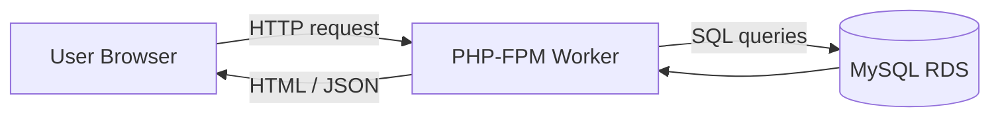

Each request **occupies one PHP worker + one DB connection** until finished.

---

## 4. What Happens During a Heavy Click (Filter Regenerate)

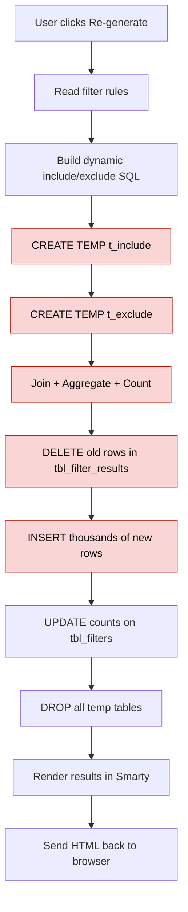

> Red boxes = heavy DB cost. **All of this runs while the user waits.**

---

## 5. Multi-User Slowdown — Stage by Stage

### Stage 1 — One user (system healthy)

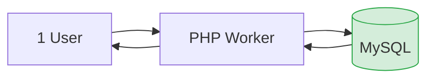

- 1 worker busy → many free  
- Response: **fast (1–2s)**

---

### Stage 2 — A few users on light pages

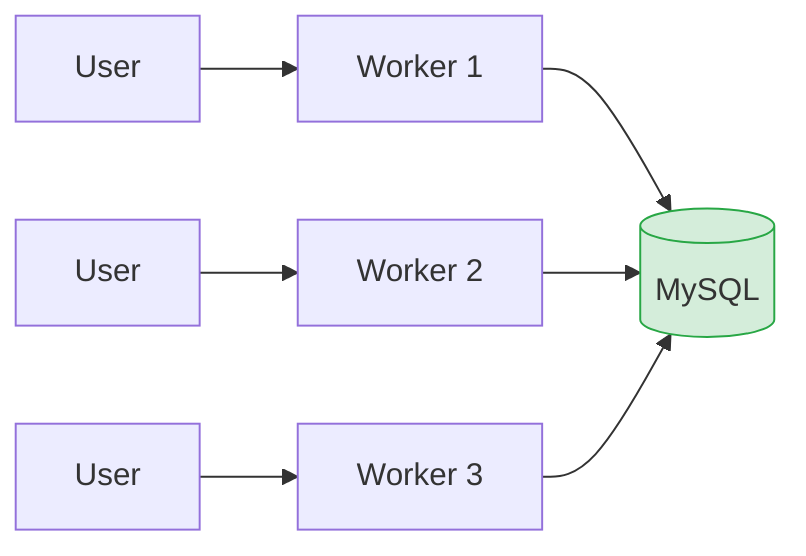

- DB serves multiple users in parallel  
- Still **fast** — this is the size the app was designed for

---

### Stage 3 — One user starts a heavy job

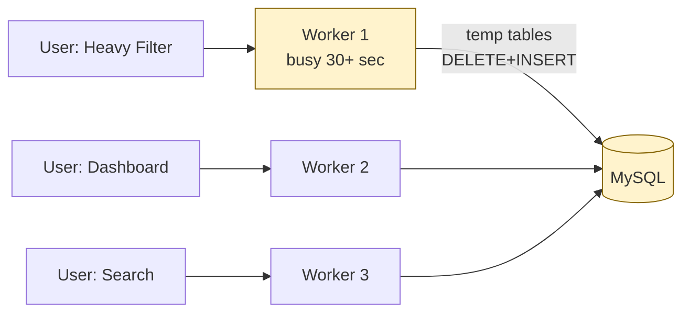

- One worker stuck  
- DB CPU/disk rising  
- Other users start to feel a slight slowdown

---

### Stage 4 — Several users + heavy and light at once

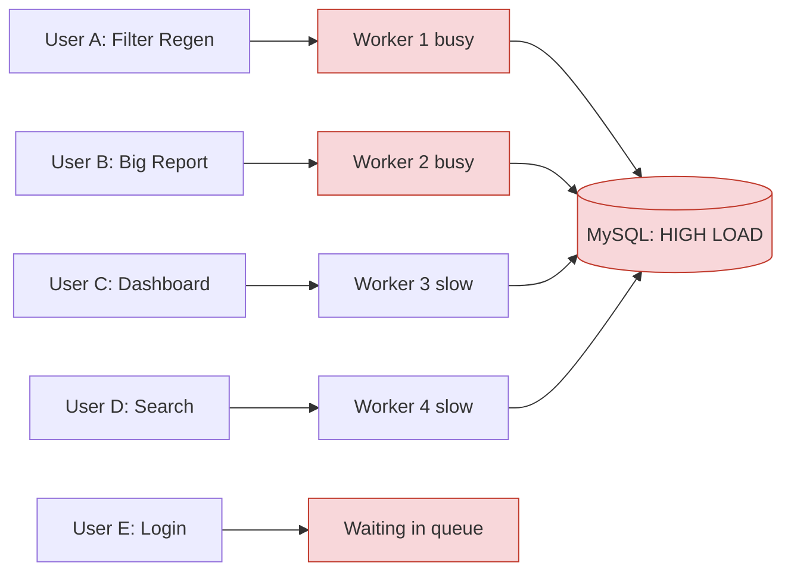

- Heavy jobs block DB resources  
- Light requests wait for DB  
- New users queue for free PHP workers  
- **Everyone feels lag, even on light screens**

---

### Stage 5 — Saturation / freeze

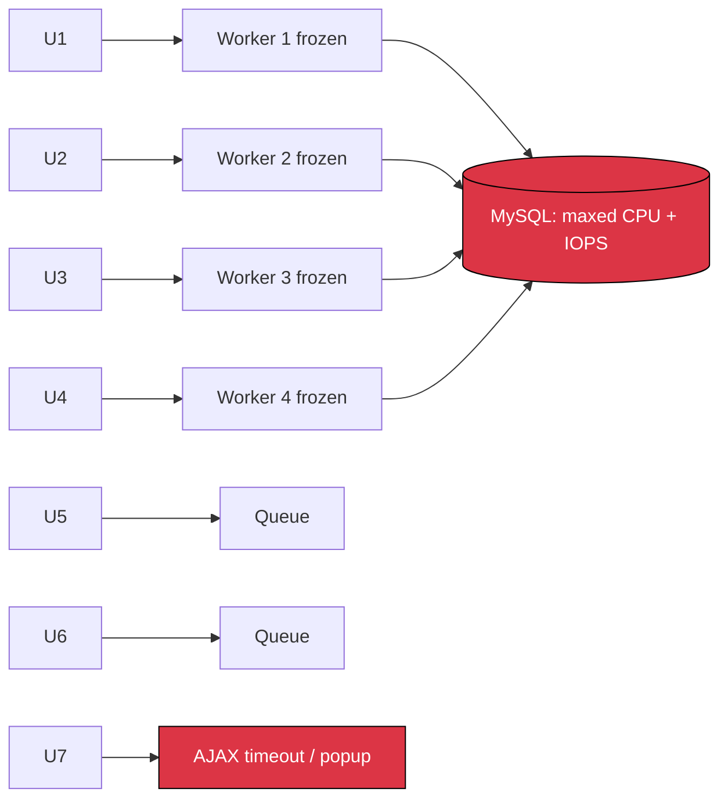

- All PHP workers stuck  
- MySQL CPU/disk saturated  
- AJAX times out → **JS popups**  
- Browser iframes appear frozen

---

## 6. Cascade Effect — Why One Bad Click Affects Everyone

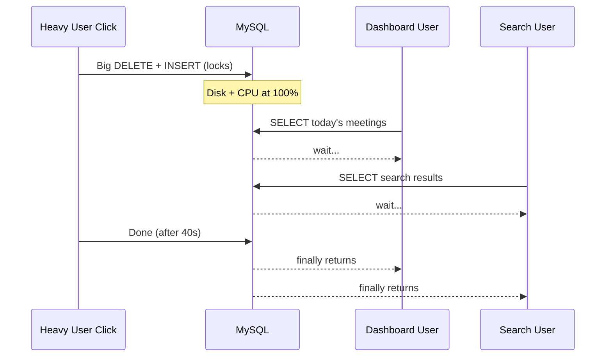

> **One heavy click = many slow clicks for unrelated users.**

---

## 7. Why JS Popups Show Up

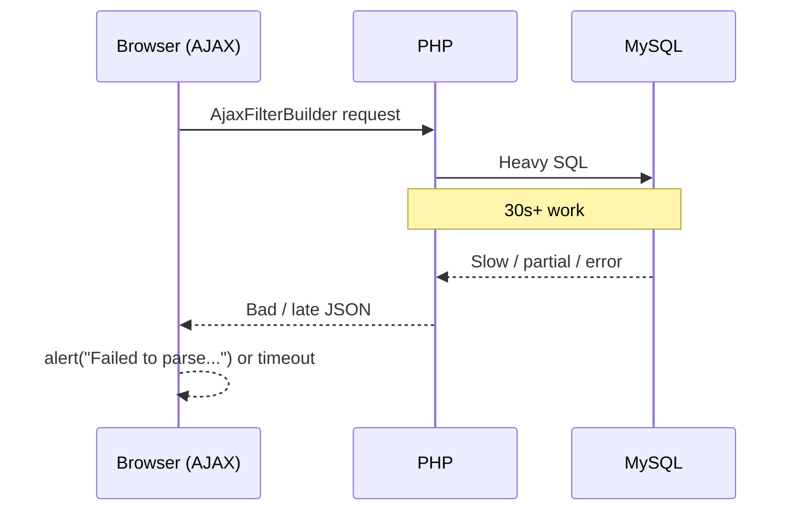

- Server too slow → AJAX **timeout**  
- PHP warning mid-AJAX → response is **not valid JSON** → JS shows **“Failed to parse response”**  
- Pre-existing click → app shows **“Please wait — action already running”** (intentional double-click guard)

> Popups are **symptoms**, not the root cause.

---

## 8. Response Time vs Concurrency (Illustrative)

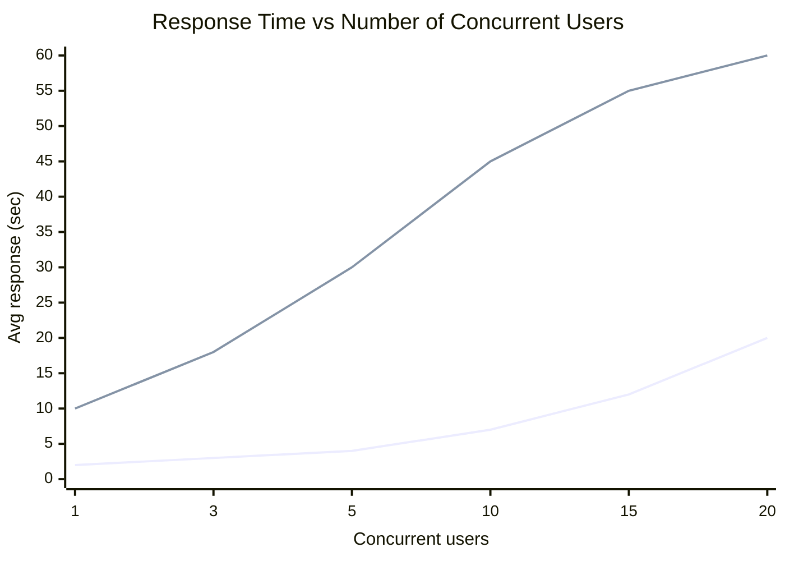

- Light pages stay OK up to ~5 users  
- Heavy actions collapse fast above 5 concurrent users  
- Above 10–15 concurrent users → system **feels broken**

---

## 9. Where MySQL Time Really Goes (Typical Breakdown)

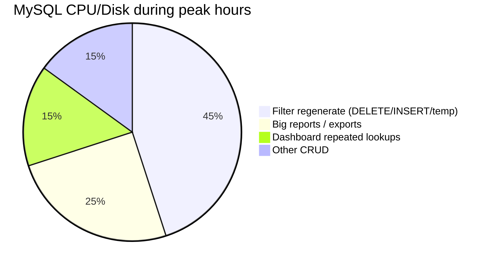

> Filter rebuilds + reports dominate.

---

## 10. Root Cause Stack

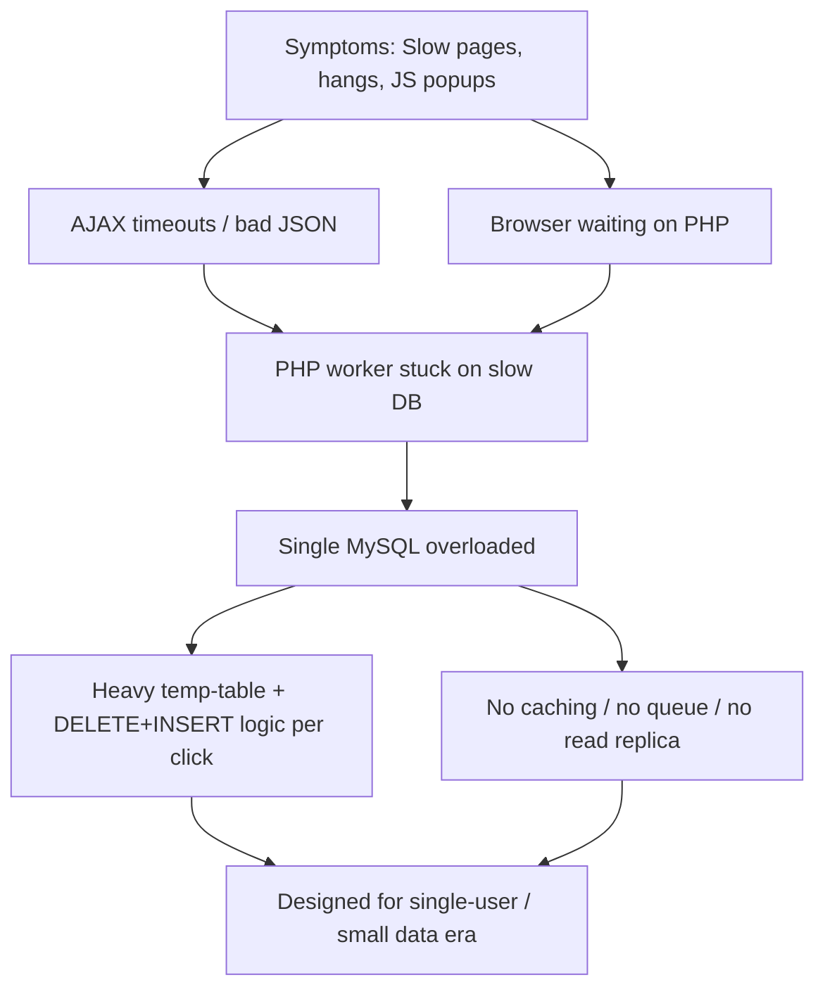

---

## 11. The Fix Path (No Rewrite Needed)

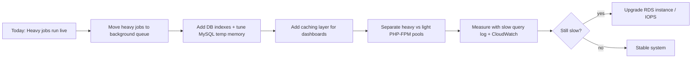

---

## 12. Server-Team Asks

### MySQL (AWS RDS)
- Confirm current **instance class**, **storage type (gp2/gp3/io1)**, **IOPS**.
- In the **Parameter Group**, set:
  - `tmp_table_size = 256M`
  - `max_heap_table_size = 256M`
  - `slow_query_log = ON`
  - `long_query_time = 1`
  - `innodb_io_capacity ≥ 1000`
- Share **CloudWatch graphs** (CPU, IOPS, Connections, FreeableMemory) for last 7 days.

### PHP / FPM
- Enable **OPcache**:
  - `opcache.enable=1`
  - `opcache.memory_consumption=256`
  - `opcache.max_accelerated_files=20000`
  - `opcache.validate_timestamps=0` (production)
- Confirm `pm.max_children`, `request_terminate_timeout`.
- Create a **second PHP-FPM pool** (`heavy`) with `request_terminate_timeout=600s` for filter regen / report endpoints.

### Nginx
- Increase `fastcgi_read_timeout` only on heavy endpoints; web default at **60s**.
- Enable gzip on JSON/JS/CSS.

---

## 13. Decision Matrix — Upgrade vs Tune vs Code Fix

| Lever | Cost | Impact | When to use |
|---|---|---|---|
| Bigger RDS instance | $$$ | Medium | Only if CPU steadily > 70% |
| More app server RAM | $ | Low–Medium | If PHP workers swap or hit memory_limit |
| Faster RDS storage (gp3 + IOPS) | $$ | High | Filter rebuild is I/O heavy |
| Tune MySQL params | Free | Medium | Always do |
| Tune PHP-FPM + OPcache | Free | High | Always do |
| **Add background queue** | Dev time | **Highest** | Real fix for hangs |
| Add caching | Dev time | High | Big help for dashboard |
| Add DB indexes | Free | Very High | Always do after slow query log |

> Hardware upgrade **first** = paying more for the same architecture problem.

---

## 14. Can Laravel Fix This?

| Question | Answer |
|---|---|
| Does Laravel make the app faster by itself? | **No.** Same logic = same speed. |
| Does Laravel improve maintainability and scaling? | **Yes.** |
| Can the current code be fixed for performance? | **Yes — without rewriting.** |

**Recommended sequence:**

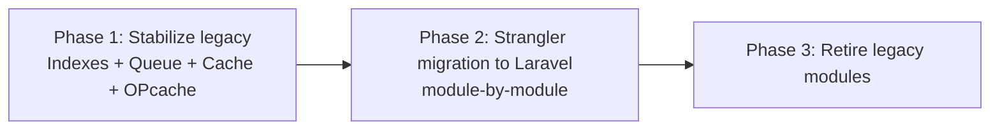

> Performance fix is **immediate**.  
> Laravel migration continues **in parallel** for long-term maintainability.  
> Migrating first **without** architectural fixes would just rebuild the same problem.

---

## 15. One-Line Summary

> **As soon as 2–3 users run heavy actions on the same MySQL, the DB becomes the bottleneck → PHP workers get stuck → AJAX times out → users see popups, freezes, and slow pages — even on light screens. Fix order: queue heavy jobs → tune DB → cache → separate traffic → upgrade hardware only if metrics still demand it.**

---

## 16. Action Checklist (Owner per Item)

| # | Action | Owner | Effort |
|---|---|---|---|
| 1 | Enable MySQL slow query log | Server team | 30 min |
| 2 | Enable OPcache in production | Server team | 30 min |
| 3 | Confirm RDS parameter group + IOPS | Server team | 1–2 hr |
| 4 | Add DB indexes from slow log | Dev + DBA | 1 day |
| 5 | Move filter regenerate to background queue | Dev | 1–2 weeks |
| 6 | Cache dropdowns/lookups (APCu) | Dev | 2–3 days |
| 7 | Split heavy vs light PHP-FPM pool | Server team | 1 day |
| 8 | Re-measure & decide on RDS upgrade | All | After above |

---

*End of report.*
